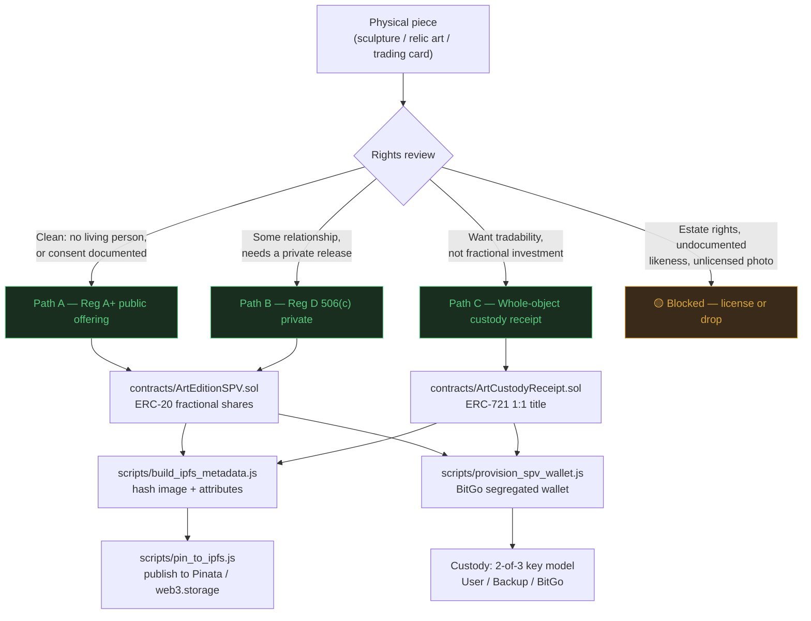
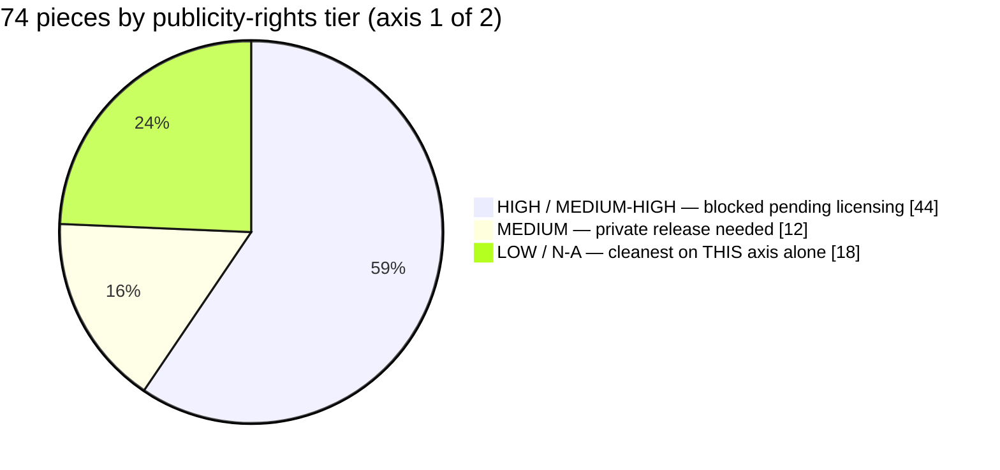
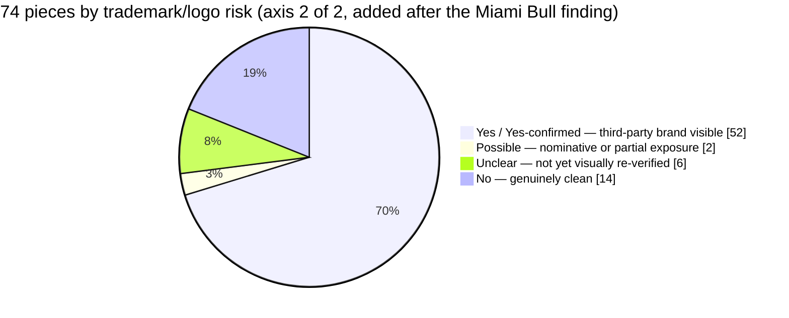

# Relics

**Tokenization infrastructure for physical collectibles** — hand-cast sculpture, relic-embedded art, and authenticated trading cards, structured into single-purpose vehicles, hashed to IPFS, and custodied through segregated BitGo wallets.

[](./LICENSE)
[](./contracts)
[](./contracts)
[](#status-legend)
[](./catalog)

Part of the [FTHTrading](https://github.com/FTHTrading) / UnyKorn stack. Public showcase: [relics.unykorn.ai](https://relics.unykorn.ai) (proposed, not yet deployed — see [Status](#status-legend)).

---

## Table of contents

- [About](#about)
- [Status legend](#status-legend)
- [Architecture](#architecture)
- [Structuring paths](#structuring-paths)
- [Repository layout](#repository-layout)
- [The catalog](#the-catalog)
- [Contracts](#contracts)
- [Scripts](#scripts)
- [Custody model](#custody-model)
- [Getting started](#getting-started)
- [Roadmap](#roadmap)
- [License](#license)

---

## About

**Relics** is the engineering repo behind a simple idea: physical collectibles — a bronze hand cast, a framed piece with an authenticated jersey swatch, a vaulted trading card — can be structured, verified, and (where the law allows) fractionally owned, the same way real estate and gold already are on the rest of the UnyKorn stack.

It grew out of a working review of the **OG4ever / Bottega Mortet** catalog: 74 pieces across 17 artists (Dante & Lorenzo Mortet, Murray Henderson, Lili Cantero, and others). Every piece was individually reviewed for publicity-rights exposure, authentication quality, and copyright risk before anything here touched a smart contract. That review is the [catalog](./catalog) folder — read it before deploying anything against a new piece.

This repo does **not** sell securities, custody assets, or hold funds. It is the tooling three things get built from:

1. **Smart contracts** — fractional-share and whole-object custody tokens
2. **IPFS anchoring** — content-addressed metadata and images
3. **BitGo wallet provisioning** — segregated custody per structured piece

---

## Status legend

Every claim in this README and in the linked catalog resolves to something you can point at. Nothing is described as live unless it is.

| Badge | Meaning |
|---|---|
| 🟢 **REAL** | Built, tested or compiled, verifiable right now in this repo |
| 🟡 **GATED** | Built or scripted, but blocked on an external dependency (licensing, a live credential, a signed agreement) |
| ⚪ **THIN** | Scaffolded only — interface or stub, not load-bearing yet |

| Layer | Status | Detail |
|---|:---:|---|
| Catalog review | 🟢 REAL | 74 pieces reviewed on 2 axes (publicity-rights + trademark/logo); 3 cleared for public preview as of 2026-08-17 (was 6, before the trademark axis caught AL-02/BE-series/FJ-series) |
| Smart contracts | 🟢 REAL | Compiled clean against the pinned toolchain; **not externally audited** |
| IPFS metadata + hashing | 🟢 REAL | 6 pieces hashed (`ipfs-only-hash`, offline, `ipfs add`-compatible) |
| IPFS pinning (live network) | 🟡 GATED | Script ready (`scripts/pin_to_ipfs.js`); needs a Pinata/web3.storage API key |
| BitGo wallet provisioning | 🟡 GATED | Script ready (`scripts/provision_spv_wallet.js`); no wallet created yet |
| Securities / licensing clearance | 🟡 GATED | 0 of 74 pieces cleared for any public or private offering |
| `relics.unykorn.ai` deployment | 🟢 REAL | Live 2026-08-17. Site source not yet added to this repo — see roadmap |

---

## Architecture



## Structuring paths

Which contract a piece uses is decided by the rights review, not by preference. See [`catalog/og4ever-bottega-mortet-catalog.csv`](./catalog/og4ever-bottega-mortet-catalog.csv) for the full per-piece assessment.

| Path | Contract | Fits | Example from the catalog |
|---|---|---|---|
| 🟢 **A — Reg A+ Tier 2** | `ArtEditionSPV` | No living person depicted, or consent fully documented | *David on the Move* (classical reinterpretation, no living subject) |
| 🟢 **B — Reg D 506(c)** | `ArtEditionSPV` | Some documented relationship; needs a private-placement release, not full public clearance | Hugo Sanchez pieces (artist photographed with subject at signing) |
| 🟢 **C — Custody receipt** | `ArtCustodyReceipt` | Buyer wants outright title, not fractional investment; best fit for trading cards | Murray Henderson's *Beautiful Dozen* card set |
| 🟡 **Blocked** | — | Deceased-person estate rights, unlicensed photo, undocumented celebrity likeness, **or unresolved trademark/sponsor-logo exposure** | Any Maradona / Kobe / Senna piece; the John Dominis 1968 photo piece; *Miami Bull* (see [below](#the-catalog)) |

`ArtEditionSPV` and `ArtCustodyReceipt` are **deliberately separate contracts**, not one contract with a mode flag — it keeps the Howey Test analysis clean for whichever path a given piece uses.

> ⚠️ **A piece needs to clear two independent axes, not one.** *Publicity-rights risk* (does the piece depict a real person without documented consent) and *trademark/logo risk* (does the piece depict a third party's brand — a sponsor logo, team crest, league mark) are separate legal questions. A piece can pass one and fail the other — see the *Miami Bull* finding below, which cleared publicity-rights review cleanly (no face shown) while carrying an undisclosed "ORACLE" wordmark and Mobil 1 / Bosch branding across the car livery.

---

## Repository layout

```
Relics/
├── contracts/
│   ├── ArtEditionSPV.sol        # ERC-20 fractional SPV shares (Path A / B)
│   └── ArtCustodyReceipt.sol    # ERC-721 whole-object custody receipt (Path C)
├── scripts/
│   ├── build_ipfs_metadata.js   # Hash images + build metadata JSON (offline, real CIDs)
│   ├── pin_to_ipfs.js           # Publish hashed content to a live IPFS pinning service
│   └── provision_spv_wallet.js  # BitGo segregated-wallet provisioning (2-of-3)
├── catalog/
│   └── og4ever-bottega-mortet-catalog.csv   # 74-piece rights/structuring review
├── deals/
│   └── BM-07-david-on-the-move.json         # Sample deal-intake file for provisioning
├── package.json
├── LICENSE
└── README.md
```

---

## The catalog

[`catalog/og4ever-bottega-mortet-catalog.csv`](./catalog/og4ever-bottega-mortet-catalog.csv) is the source of truth for what can be structured and how. Columns: artist, medium, edition size, indicative price, **publicity-rights risk tier**, **trademark/logo risk** (added 2026-08-17, see finding below), **recommended structuring path**, and reviewer notes for each axis.





Counts computed directly from the CSV — recount if the catalog changes rather than trusting these numbers to stay in sync on their own.

### Finding: publicity-rights clearance is not trademark clearance (2026-08-17)

*Miami Bull* (AL-02, Anita Lewis) passed the original publicity-rights review cleanly — Formula 1 car, no driver's face shown, tagged `N/A - NOT DEPICTING A PERSON` and cleared as a "strong candidate" for Path A. A follow-up visual review found the painting spells out the **"ORACLE"** sponsor wordmark prominently across the livery, plus **Mobil 1** and **Bosch** marks — real, active corporate trademark material that the original review taxonomy was never built to catch, because it only checked for a depicted *person's* likeness, not a depicted *brand's* mark.

Widening the check to the rest of the catalog found the same gap in two more places already sitting in the "cleanest" tier: **Betirri's kit paintings** (BE-01/02/03 — Argentina/Brazil, River/Boca, Inter/Milan crests, no faces shown) and **Felipe Jacome's club-player prints** (FJ-01/02/03 — visible club kit branding on a subject who isn't a global public figure). All six pieces are now marked `BLOCKED pending trademark clearance` in the CSV, downgraded from their original "strong candidate" status. *David on the Move* (BM-07) and Dwyane Wade's own two pieces (DW-01/02) are the only pieces in the original clean tier that hold up on both axes — DW-01/02 carry a separate, softer flag: the physical medium is an NBA-branded game-floor segment, worth a chain-of-title check even though the painted image itself shows no logo.

**Read `Trademark / Logo Risk` alongside `Publicity-Rights Risk Tier`, not instead of it, before treating any piece as cleared.**

## Contracts

Both compile clean against solc `0.8.24`, optimizer 200 runs, `evm_version paris`, OpenZeppelin `v5.0.2` — the pinned toolchain shared with `smart-contract-builder` / `unykorn-studio`.

### `ArtEditionSPV.sol` — 🟢 REAL (compiled) / 🟡 GATED (unaudited, undeployed)

ERC-20 fractional membership interest in a single-purpose entity holding one physical piece.

- KYC-gated transfers via a pluggable `IIdentityRegistry`
- Sanctions freeze + regulator/court-ordered forced transfer
- Optional `IComplianceModule` hook (per-offering rules: accredited-only caps, jurisdiction blocks)
- On-chain `AssetInfo` (artist, title, edition size, SPV entity name, custodian, IPFS metadata CID)
- Dust-free **magnified-per-share** proceeds distributor — pull-based, never iterates the holder set
- `logReceipt()` anchors an off-chain ops-receipt hash, matching the hash-chained `ops.receipts` pattern used elsewhere in the stack

### `ArtCustodyReceipt.sol` — 🟢 REAL (compiled) / 🟡 GATED (unaudited, undeployed)

ERC-721 whole-object custody receipt — 1 token = 100% title to one physical item, no pooling.

- EIP-712 signed **custody attestations** (proof-of-custody heartbeat, same shape as `RWAOracle` / `ProofOfReserveConsumer` elsewhere in the library)
- Redemption flow: holder requests → custodian executes physical handoff → token burns
- `tokenURI()` resolves to the IPFS-pinned metadata JSON
- Optional per-token KYC gate on transfer (`requireVerification`)

> ⚠️ May overlap with `MomentRelicVault.sol` (shipped 2026-08-11, ERC-1155 vault for Moment Relics). Reconcile the two before deploying either in production — don't ship duplicate custody-vault logic.

---

## Scripts

| Script | Status | Does |
|---|:---:|---|
| `scripts/build_ipfs_metadata.js` | 🟢 REAL | Hashes images + builds ERC-721-style metadata JSON offline. Real `ipfs add`-compatible CIDs — not placeholders. |
| `scripts/pin_to_ipfs.js` | 🟡 GATED | Publishes the above to Pinata or web3.storage. Needs `PINATA_JWT` or `WEB3_STORAGE_TOKEN`. |
| `scripts/provision_spv_wallet.js` | 🟡 GATED | Provisions a segregated 2-of-3 BitGo wallet per SPV. Needs `BITGO_ACCESS_TOKEN` + `BITGO_WALLET_PASSPHRASE`. |

Public metadata deliberately **excludes** the catalog's internal fields (risk tier, structuring path, reviewer notes) — that's ops/legal data, not something to anchor permanently on a public content-addressed network.

## Custody model

UnyKorn never takes custody of the underlying asset or its token. Qualified custody is delegated to **BitGo Bank & Trust, N.A.** Every structured piece gets its own segregated wallet — never a shared pool, never commingled with another SPV's assets.

```mermaid
sequenceDiagram
    participant U as UnyKorn (user key)
    participant B as Backup key (offline)
    participant BG as BitGo (custodian key)
    participant C as Counterparty<br/>(consignor / artist)

    Note over U,BG: Step 1 — 2-of-3 wallet created per SPV
    U->>BG: generateWallet({label, enterprise, m:2, n:3})
    BG-->>U: wallet id

    Note over U,C: Step 2 — counterparty added, wallet-scoped ONLY
    U->>BG: shareWallet({email, permissions:"view"})
    BG-->>C: view/spend access to this wallet only

    Note over U,BG: Step 3 — policy applied before first funding<br/>(BitGo auto-locks policy 48h after set)
    U->>BG: updatePolicyRule(dailyVelocity, fourEyes)

    Note over U,BG,B: Any transfer needs 2 of the 3 keys
    U->>BG: sign transaction
    B-->>BG: co-sign (only if user key unavailable)
    BG->>BG: enforce policy + release funds
```

No single party — including UnyKorn — can move funds alone. This mirrors the same 9-step deal loop already used for other segregated-wallet SPVs on the parent BitGo enterprise (create → share → policy → KYC gate → fund → tokenize → operate → report → bill).

---

## Getting started

```bash
git clone https://github.com/FTHTrading/Relics.git
cd Relics
npm install

# 1. Compile the contracts (requires solc + @openzeppelin/contracts, see package.json)
npm run compile

# 2. Hash catalog images + build IPFS metadata (offline, no API key needed)
npm run build-metadata

# 3. Pin to a live IPFS network (needs a Pinata or web3.storage token)
PINATA_JWT=xxxxx npm run pin -- pinata

# 4. Provision a segregated BitGo wallet for one SPV (needs BitGo credentials)
BITGO_ACCESS_TOKEN=xxx BITGO_WALLET_PASSPHRASE=yyy \
  npm run provision-wallet -- --deal deals/BM-07-david-on-the-move.json --env test
```

Start on `--env test` (BitGo sandbox) for everything. Production runs require `CONFIRM_PROD=1` as a deliberate guard rail against an accidental live run.

## Roadmap

- [ ] External security audit of both contracts (currently unaudited — do not deploy to mainnet before this)
- [ ] Reconcile `ArtCustodyReceipt.sol` against `MomentRelicVault.sol` to avoid duplicate custody-vault logic
- [ ] Publicity-rights licensing for the 44 HIGH/MEDIUM-HIGH catalog pieces (see [catalog](./catalog))
- [ ] Trademark clearance for the 6 pieces downgraded 2026-08-17 (BE-01/02/03, FJ-01/02/03) plus a formal opinion on AL-02 (*Miami Bull*) before any of them re-enters a cleared tier
- [ ] Chain-of-title confirmation for DW-01/02's underlying NBA game-floor segment
- [ ] Pin the 6 hashed pieces to a live IPFS network
- [ ] Provision the first live BitGo sandbox wallet end-to-end
- [x] Deploy [relics.unykorn.ai](https://relics.unykorn.ai) — live 2026-08-17
- [ ] Add the site source itself to this repo (currently deployed from a separate local build, not yet checked in here)
- [ ] Securities counsel review of Path A (Reg A+) vs. Path B (Reg D 506(c)) before any offering document is drafted

---

## License

[MIT](./LICENSE) © 2026 FTHTrading

---

*This repository is engineering infrastructure, not an offer to sell securities. No piece in the [catalog](./catalog) is currently offered to any investor. See the [status legend](#status-legend) before citing anything here as live.*
